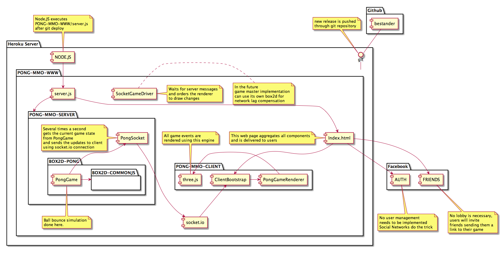

Mass multiplayer online game of Pong
====

This document describes the roadmap, goals and design consideration of a multiplayer Pong game written in JavaScript.  

Goal
----

This is a purely academic activity with intentions to catch up in the areas of:
- cloud computing, 
- clientside mv* frameworks,
- game development (networking, physics, graphics), 
- Behavior Driven Development
- UML design 

and many more.   

I also am looking forward to meeting the performance requirements: how many players a large Amazon EC2 instance will handle while maintaining enjoyable latency.  
That should be fun to try Node's profiler tools, write benchmark tests and do optimizations.

Architecture
----

In essence the game is a client-server application written in JavaScript and deployed to cloud PaaS or IaaS.
[Node.JS](www.nodejs.org) is my platform of choice that provides a lot of flexibility, very strong community of enthusiasts, amazing performance and is extremely lightweight.

- For the time being I chose [heroku](www.heroku.com) as a platform because it integrates with [Node](www.nodejs.org) and [git](www.github.com) seemlessly.
- As a communication layer between client and server I chose [socket.io](www.socket.io)
- For graphics rendering I chose [CAAT](https://github.com/hyperandroid/CAAT) which can render HTML5 graphics using canvas, webGL or CSS3
- For physics simulation I chose [box2d](http://box2d.org/), the JavaScript port of it may be a bottleneck and I will have performance tests
- To spare myself from user management and authentication I decided to integrate with Social Networks like Facebook and Twitter using [placeholder](still choosing tool)
- And for the actual web page that will host the game I chose [Backbone](www.backbonejs.org) MVC framework and [Twitter Bootstrap](twitter.github.com/bootstrap/) for layout

The following picture describes the overall architecture.

## Modules

- test
- tes

Diafram 2.
Components.

Diagram 3.
Update game state sequence diagram.

Diagram 4.
User connection sequence diagram.
